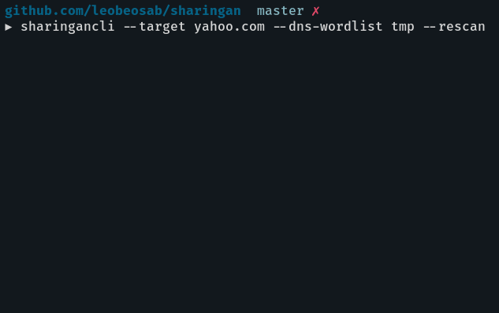

# Sharingan

<p align="center">
	
</p>

Sharingan is a recon multitool for offensive security / bug bounty

Currently the only working features are DNS bruteforcing and checking if the host is up using nmap

This is very much a work in progress and I'm relatively new to offensive security in general so if you see something that can be improved please open an issue or PR with suggested changes.

## Cloning
`go get github.com/leobeosab/sharingan`

## Dependencies
*   NMap
*   Go

## Usage
sharingan --target target.com --dns-wordlist /path/to/wordlist/



## Help
```
▶ sharingancli --help
NAME:
   Sharingan - Wrapper and analyzer for offensive security recon tools

USAGE:
   sharingancli [global options] command [command options] [arguments...]

VERSION:
   0.0.0

COMMANDS:
   help, h  Shows a list of commands or help for one command

GLOBAL OPTIONS:
   --dns-wordlist value  Wordlist for DNS bruteforcing
   --target value        Target domain
   --skip-probe          Skips host-up nmap scan
   --rescan              Scans domain regardless of the existance of previous results
   --help, -h            show help
   --version, -v         print the version
```

## TODO
*   Better progress bars
*   Concurrent DNS bruteforce
*   JSON and regular file exports
*   Automated scans through a daemon?
*   Dir brute forcing
*   NMap full service scans
*   Possible Web ui / html export
