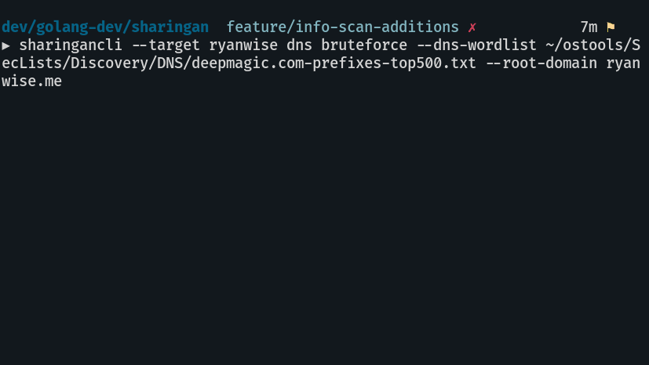
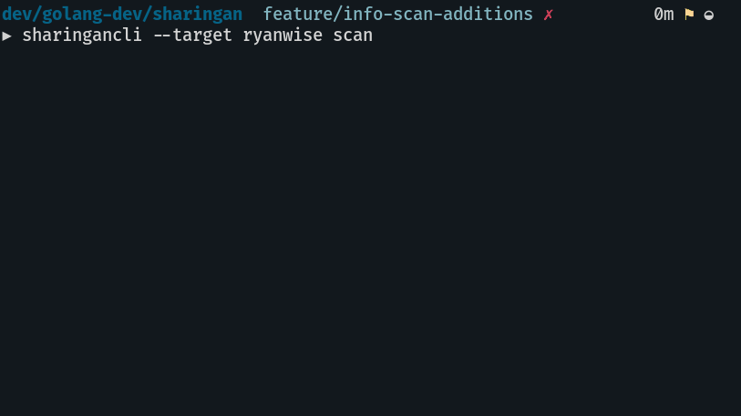

# Sharingan

<p align="center">
	
</p>

Sharingan is a recon multitool for offensive security / bug bounty

This is very much a work in progress and I'm relatively new to offensive security in general so if you see something that can be improved please open an issue or PR with suggested changes.

## Cloning for development
Outside of your gopath
`git clone https://github.com/leobeosab/sharingan`

## Installing
`go get github.com/leobeosab/sharingan/cmd/sharingancli`

## Dependencies
*   NMap
*   Go

## Usage
#### Note
Order matters when it comes to flags it must be `sharingancli [globalflags] command [commandflags]` if this isn't a wanted feature I can change it but I like how clean it is

### DNS
DNS busts the target with a wordlist you provide 
`sharingancli --target target.com --dns-wordlist /path/to/wordlist/ dns`


### NMap Scan
Brings up a list of hosts found in previous dns scan if no hosts are found it asks if you want to run it on the target itself
`sharingancli --target target.com scan`


## Help
```
▶ sharingancli --help
NAME:
   Sharingan - Wrapper and analyzer for offensive security recon tools

USAGE:
   sharingancli [global options] command [command options] [arguments...]

VERSION:
   0.0.0

COMMANDS:
   help, h  Shows a list of commands or help for one command

GLOBAL OPTIONS:
   --dns-wordlist value  Wordlist for DNS bruteforcing
   --target value        Target domain
   --skip-probe          Skips host-up nmap scan
   --rescan              Scans domain regardless of the existance of previous results
   --help, -h            show help
   --version, -v         print the version
```

## TODO
*   Better progress bars
*   JSON and regular file exports
*   Automated scans through a daemon?
*   Dir brute forcing
*   Saving nmap scan data
*   Mass nmap scans
*   Possible Web ui / html export
