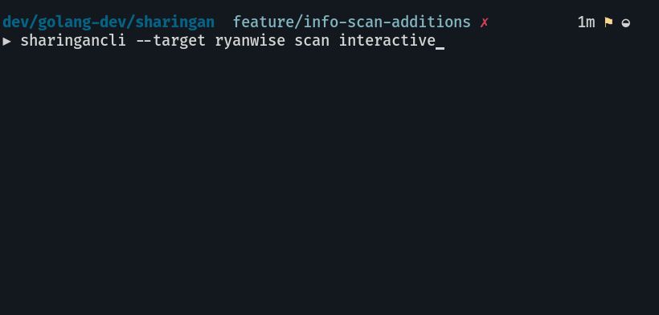
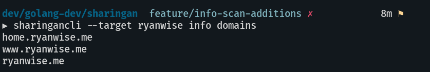

# Sharingan

<p align="center">
	
</p>

Sharingan is a recon multitool for offensive security / bug bounty

WIP, will I ever finish? Who knows

## Cloning for development
Outside of your gopath
`git clone https://github.com/leobeosab/sharingan`

## Installing
`go get github.com/leobeosab/sharingan/cmd/sharingancli`

## Dependencies
*   NMap
*   Go

## Usage
#### Note
Order matters when it comes to flags it must be `sharingancli [globalflags] command [commandflags]` if this isn't a wanted feature I can change it but I like how clean it is

### DNS
#### bruteforce
DNS busts the target with a wordlist you provide 
```
sharingancli --target targetname dns --dns-wordlist ~/path/to/wordlist --root-domain target.com
```


#### addsubs
Adds subdomains to the program's storage from stdin using pipes
```
cat subs | sharingancli --target targetname dns addsubs
```

### Scan
Scans all hosts available that were stored in target using nmap
```
sharingancli --target target scan
```


#### interactive
Scan a single host from list of subdomains stored in target 
```
sharingancli --target target scan interactive
```


### info
#### domains
Outputs all domains as a list in stdout
```
sharingancli --target target info domains
```


## Features to come 
*   Dir brute forcing -- Currently being worked on
*   JSON and regular file exports
*   Automated scans through a daemon?
*   add a way to do SYN / -sS scanning [ must be root so it presents a challenge ]
*   Possible Web ui / html export
